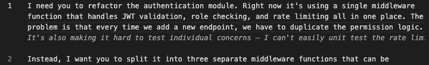
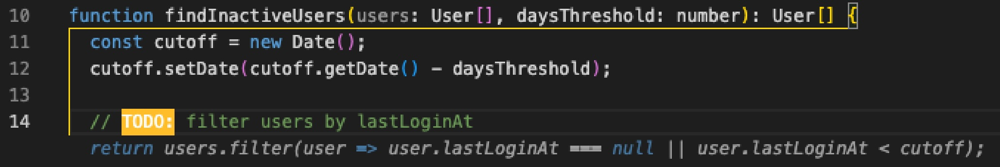
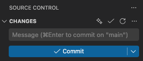

<p align="center">
  
</p>

<h1 align="center">Bespoke AI</h1>

<p align="center">
  <strong>AI autocomplete and commit messages for VS Code — powered by Claude Code or your API key</strong>
</p>

<p align="center">
  <a href="https://marketplace.visualstudio.com/items?itemName=trentmcnitt.bespoke-ai"></a>
  <a href="LICENSE"></a>
</p>

> **New here?** The extension auto-detects your setup — use your existing Claude subscription or bring your own API key. [Open an issue](https://github.com/trentmcnitt/bespoke-ai-vscode-ext/issues) if you run into problems.

**🖊️ Writing, not just code** — Inline completions for prompts, journals, notes, and docs — plus all the code completions you'd expect.

**🚀 Flexible backends** — Use your Claude subscription (no per-token billing) OR bring your own API key (Anthropic, OpenAI, Google Gemini, xAI, OpenRouter, Ollama).

**🤖 AI-assisted prompt writing** — Use AI to help you write better prompts to AI.

**✨ One-click commit messages** — Hit the sparkle button in Source Control to generate a commit message from your staged diffs.

### 🖼️ Screenshots

**Writing** — autocompleting a prompt to Claude:



**Code** — filling in a function body from the name and context:



**Commit messages** — the sparkle button in Source Control:



## 💡 Why This Exists

I tried every open-source AI autocomplete extension I could find. None of them handled writing well — things like autocompleting prompts, journal entries, or documentation. They'd break paragraphs mid-thought, inject code syntax, or produce gibberish outside of source code files. Nothing came close to Copilot for non-code text.

So I decided to build my own. And since I was already paying for a Claude subscription, I realized I didn't need to pay for API calls at all — I could wire it up to use Claude Code instead of raw API calls. Built on the [Claude Agent SDK](https://www.npmjs.com/package/@anthropic-ai/claude-agent-sdk), it took a lot of prompt engineering to get completions that felt natural — but the result is an extension that handles writing just as well as code.

### 🔑 No Per-Request API Costs

Most AI extensions charge per API call or push you toward cheaper models to keep costs down. Bespoke AI runs on Claude Code via the Agent SDK, which uses your existing Claude subscription (Pro, Team, or Enterprise). That means you get frontier model completions — Haiku, Sonnet, even Opus — at no additional cost per request.

## ✨ Features

- **🖊️ Writing completions** — Natural continuation that matches the tone and format of surrounding text. Works in markdown, plaintext, LaTeX, and more.
- **💻 Code completions** — Fill-in-the-middle with prefix + suffix context. Auto-detected by file type.
- **🧠 Mode detection** — Auto-switches between writing and code based on file type. Unknown languages default to writing.
- **✨ Commit messages** — One-click AI commit messages. The sparkle button in Source Control generates a message from your staged diffs and drops it into the message box.
- **✏️ Suggest edits** — One-command typo, grammar, and bug fixes for visible text.
- **🔧 Context menu** — Right-click to Explain, Fix, or Do custom actions on selected text.

## 🚀 Getting Started

Install from the [VS Code Marketplace](https://marketplace.visualstudio.com/items?itemName=trentmcnitt.bespoke-ai) (search "Bespoke AI"). On first launch, the extension checks for the Claude Code CLI and offers you a choice — install the CLI or switch to API mode with your own key.

### Option A: Claude Code CLI (recommended for Claude subscribers)

Use your existing Claude subscription — no per-token billing.

1. Install [Claude Code](https://docs.anthropic.com/en/docs/claude-code/setup):
   ```bash
   # macOS / Linux
   curl -fsSL https://claude.ai/install.sh | bash
   # Windows (or any platform via npm)
   npm install -g @anthropic-ai/claude-code
   ```
2. Authenticate — run `claude` in your terminal and follow the login prompts
3. Have an active Claude subscription (Pro, Team, or Enterprise)
4. Reload VS Code — completions appear as ghost text after a ~2 second pause

> **Recommended model:** Sonnet (the default) — best balance of quality and speed for both prose and code. Switch to Haiku for faster, lighter completions via the status bar menu.

### Option B: API Key (recommended for non-subscribers)

Bring your own API key — pay per token with the provider of your choice.

1. Choose "Use an API key instead" when prompted (or set `bespokeAI.backend` to `"api"` in settings)
2. Run the **"Bespoke AI: Enter API Key"** command (`Ctrl+Shift+P` → "Enter API Key") to securely store your key in the OS keychain
3. Start typing — completions appear as ghost text

> **Recommended model:** [Grok 4.1 Fast](https://console.x.ai/) (`xai-grok`, the default) — fast, affordable, and high quality for both prose and code.

**Built-in models:**

| Preset                    | Provider                                    | Model                       | API Key              |
| ------------------------- | ------------------------------------------- | --------------------------- | -------------------- |
| `xai-grok` (default)     | [xAI](https://console.x.ai/)               | grok-4-1-fast-non-reasoning | `XAI_API_KEY`        |
| `xai-grok-code`          | [xAI](https://console.x.ai/)               | grok-code-fast-1            | `XAI_API_KEY`        |
| `xai-grok-4`             | [xAI](https://console.x.ai/)               | grok-4-0709                 | `XAI_API_KEY`        |
| `anthropic-haiku`        | [Anthropic](https://console.anthropic.com/) | claude-haiku-4-5            | `ANTHROPIC_API_KEY`  |
| `anthropic-sonnet`       | [Anthropic](https://console.anthropic.com/) | claude-sonnet-4-5           | `ANTHROPIC_API_KEY`  |
| `openai-gpt-4.1-nano`   | [OpenAI](https://platform.openai.com/)      | gpt-4.1-nano                | `OPENAI_API_KEY`     |
| `openai-gpt-4o-mini`    | [OpenAI](https://platform.openai.com/)      | gpt-4o-mini                 | `OPENAI_API_KEY`     |
| `google-gemini-flash`   | [Google](https://aistudio.google.com/)      | gemini-2.5-flash            | `GEMINI_API_KEY`     |
| `openrouter-haiku`      | [OpenRouter](https://openrouter.ai/)        | anthropic/claude-haiku-4.5  | `OPENROUTER_API_KEY` |
| `openrouter-gpt-4.1-nano` | [OpenRouter](https://openrouter.ai/)      | openai/gpt-4.1-nano         | `OPENROUTER_API_KEY` |
| `ollama-default`        | [Ollama](https://ollama.com/) (local, free) | qwen2.5-coder               | none                 |
| `ollama-qwen3-4b`       | [Ollama](https://ollama.com/) (local, free) | qwen3:4b                    | none                 |
| `ollama-qwen3-8b`       | [Ollama](https://ollama.com/) (local, free) | qwen3:8b                    | none                 |

Change models anytime via the status bar menu or `bespokeAI.api.preset` setting.

**Custom models:** Use the **"Bespoke AI: Add Custom Model"** command (`Ctrl+Shift+P` → "Add Custom Model") for a guided setup wizard. Any OpenAI-compatible API (LM Studio, Together, Mistral, etc.), Anthropic, Google Gemini, or OpenRouter endpoint works. You can also add models manually via the `bespokeAI.api.customPresets` setting:

```json
"bespokeAI.api.customPresets": [
  { "name": "My Llama", "provider": "openai-compat", "modelId": "llama3.2", "baseUrl": "http://localhost:1234/v1" }
]
```

**API key resolution:** Keys are resolved in this order: (1) VS Code SecretStorage (stored via the "Enter API Key" command), (2) environment variables, (3) `~/.creds/api-keys.env` file.

> **Note:** Context menu commands (Explain, Fix, Do) require the Claude Code CLI backend and are hidden in API mode.

### Triggering Completions

Completions appear automatically after a ~2 second pause (the `relaxed` preset). Press **Alt+Enter** to trigger one instantly at any time.

> **Important:** If `Alt+Enter` doesn't work, another keybinding is likely intercepting it. Open Keyboard Shortcuts (`Ctrl+K Ctrl+S`), search for `alt+enter`, and remove or rebind any conflicting entries — **Inline Chat** is the most common culprit.

Change the trigger behavior via the status bar menu: `relaxed` (~2s delay), `eager` (~800ms), or `on-demand` (Alt+Enter only).

> **Platform:** macOS, Linux, and Windows.

### Modes

| Mode        | Activates for                                                    | Strategy                                                    |
| ----------- | ---------------------------------------------------------------- | ----------------------------------------------------------- |
| **Writing** | `markdown`, `plaintext`, `latex`, `restructuredtext`, and others | Continuation-style prompting. Matches voice, style, format. |
| **Code**    | All recognized programming languages                             | Prefix + suffix context, language-aware.                    |
| **Auto**    | Default                                                          | Auto-selects based on file type.                            |

Auto mode is the default. Override via settings or the status bar menu. (Settings use `prose` internally — e.g., `bespokeAI.mode: "prose"`.)

## ⚙️ Configuration

All settings live under `bespokeAI.*` in VS Code settings.

<details>
<summary><strong>General</strong></summary>

| Setting         | Default     | Description                                                                     |
| --------------- | ----------- | ------------------------------------------------------------------------------- |
| `enabled`       | `true`      | Master on/off toggle                                                            |
| `mode`          | `"auto"`    | Completion mode (auto-detects)                                                  |
| `triggerPreset` | `"relaxed"` | Trigger preset: `relaxed` (~2s), `eager` (~800ms), `on-demand` (Alt+Enter only) |
| `debounceMs`    | `2000`      | Override the debounce delay from your trigger preset                            |
| `logLevel`      | `"info"`    | Logging verbosity in Output channel                                             |

</details>

<details>
<summary><strong>Backend</strong></summary>

| Setting      | Default             | Description                                                 |
| ------------ | ------------------- | ----------------------------------------------------------- |
| `backend`    | `"claude-code"`     | Active backend: `claude-code` (CLI) or `api` (HTTP)         |
| `api.preset` | `"xai-grok"`        | Active API model (dropdown in settings, or status bar menu) |

</details>

<details>
<summary><strong>Model (Claude Code backend)</strong></summary>

| Setting             | Default                       | Description                              |
| ------------------- | ----------------------------- | ---------------------------------------- |
| `claudeCode.model`  | `"sonnet"`                    | Active model (sonnet, haiku, opus, etc.) |
| `claudeCode.models` | `["haiku", "sonnet", "opus"]` | Available models catalog                 |

</details>

<details>
<summary><strong>Context Windows</strong></summary>

| Setting              | Default | Description                                 |
| -------------------- | ------- | ------------------------------------------- |
| `prose.contextChars` | `2500`  | Prefix context (characters) for writing     |
| `prose.suffixChars`  | `2000`  | Suffix context (characters) for writing     |
| `prose.fileTypes`    | `[]`    | Additional language IDs to treat as writing |
| `code.contextChars`  | `2500`  | Prefix context (characters) for code        |
| `code.suffixChars`   | `2000`  | Suffix context (characters) for code        |

</details>

<details>
<summary><strong>Code Override</strong></summary>

Route code completions to a different backend or model than prose. For example, use Claude Code CLI for writing and an xAI preset for code — or vice versa.

| Setting                 | Default | Description                                                                                                     |
| ----------------------- | ------- | --------------------------------------------------------------------------------------------------------------- |
| `codeOverride.backend`  | `""`    | Backend for code files: `claude-code`, `api`, or empty (use global default)                                     |
| `codeOverride.model`    | `""`    | Model for code files. CLI: model name (e.g. `haiku`). API: preset ID (e.g. `xai-grok-code`). Empty = default. |

</details>

<details>
<summary><strong>Context Menu Permissions</strong></summary>

| Setting                      | Default     | Description                          |
| ---------------------------- | ----------- | ------------------------------------ |
| `contextMenu.permissionMode` | `"default"` | Permission mode for Explain, Fix, Do |

Options:

- **`default`** — Ask before every action (safest)
- **`acceptEdits`** — Auto-approve file reads and edits
- **`bypassPermissions`** — Skip all permission checks (use with caution)

</details>

## 📋 Commands

| Command                   | Keybinding  | Description                             |
| ------------------------- | ----------- | --------------------------------------- |
| `Trigger Completion`      | `Alt+Enter` | Manually trigger a completion           |
| `Toggle Enabled`          | —           | Toggle the extension on/off             |
| `Cycle Mode`              | —           | Cycle through auto → writing → code     |
| `Clear Completion Cache`  | —           | Clear the LRU cache                     |
| `Show Menu`               | —           | Status bar menu                         |
| `Generate Commit Message` | —           | AI commit message from staged diffs     |
| `Suggest Edits`           | —           | Fix typos/grammar/bugs in visible text  |
| `Explain` / `Fix` / `Do`  | —           | Context menu actions on selected text   |
| `Enter API Key`           | —           | Store an API key in the OS keychain     |
| `Remove API Key`          | —           | Remove a stored API key                 |
| `Add Custom Model`        | —           | Guided wizard to add a custom API model |
| `Remove Custom Model`     | —           | Remove a custom API model               |
| `Restart Pools`           | —           | Restart Claude Code subprocesses        |

> **Note:** Explain, Fix, and Do open a Claude Code CLI session in a terminal. Permission behavior is controlled by the `contextMenu.permissionMode` setting.

## 🏗️ Architecture

```
User types → Mode detection → Context extraction → LRU cache check
  → Debounce → Backend Router → Claude Code CLI or API → Cleanup → Ghost text
```

A **backend router** dispatches requests to the active backend. The **Claude Code CLI** backend uses the [Claude Agent SDK](https://www.npmjs.com/package/@anthropic-ai/claude-agent-sdk) and manages subprocesses through a shared pool server — multiple VS Code windows share subprocesses via IPC (Unix sockets on macOS/Linux, named pipes on Windows). The **API** backend makes direct HTTP calls to Anthropic, OpenAI-compatible (OpenAI, Google Gemini, xAI, OpenRouter), or local Ollama endpoints.

All backends share the same prompt strategy (`{{FILL_HERE}}` marker, `<COMPLETION>` tags) with backend-specific extraction (prefill for Anthropic API, preamble stripping for OpenAI-compat).

**Key design decisions:**

| Decision               | Rationale                                                        |
| ---------------------- | ---------------------------------------------------------------- |
| Writing-first defaults | Unrecognized languages fall back to writing, not code            |
| Dual backend           | Claude Code CLI for subscribers, API for key-based access        |
| Shared prompts         | Same system prompt across all backends — only extraction differs |
| No streaming           | VS Code's inline completion API requires complete strings        |
| LRU cache (50 entries) | 5-minute TTL prevents redundant calls when revisiting positions  |
| Session reuse (CLI)    | One subprocess serves many requests — avoids cold-start per call |

## 🔍 Troubleshooting

**Completions not appearing?**

- Check the status bar — is it showing "AI Off"? Click to re-enable.
- If it shows "Setup needed", the Claude Code CLI may not be installed or authenticated.
- Check if trigger preset is "on-demand" — in that mode, press `Alt+Enter` to trigger.
- Open the Output panel ("Bespoke AI") and check for errors.
- Run the "Bespoke AI: Restart Pools" command from the Command Palette.

**"Claude Code CLI not found"?**

- Install Claude Code: `curl -fsSL https://claude.ai/install.sh | bash` (macOS/Linux) or `npm install -g @anthropic-ai/claude-code` (Windows)
- Restart VS Code after installation.

**"Authentication required"?**

- Run `claude` in your terminal and follow the login prompts.
- Ensure you have an active Claude subscription (Pro, Team, or Enterprise).

**Windows: Explain/Fix/Do commands garbled?**

- Context menu commands use bash-style shell escaping. On Windows with PowerShell or cmd.exe, text containing `$`, backticks, or special characters may not pass through correctly.
- Workaround: set your VS Code terminal to Git Bash or WSL.

**Still not working?**

- Check for orphaned processes:
  - macOS/Linux: `pkill -f "claude.*dangerously-skip-permissions"`
  - Windows: Use Task Manager to end `node.exe` processes running Claude
- Check for a stale lockfile at `~/.bespokeai/pool.lock` and remove it.
- Disable and re-enable the extension.

## 🛠️ Development

```sh
npm install && npm run compile    # Build
npm run watch                     # Watch mode (F5 to launch dev host)
npm run check                     # Lint + type-check
npm run test:unit                 # Unit tests
npm run test:quality              # LLM-as-judge quality tests
```

### Tested Models

These are the models the quality test suite runs against. Contributors should test prompt changes against at least one model per extraction strategy (e.g., CLI sonnet, GPT-4.1 Nano, xAI Grok).

| # | Backend | Preset ID | Model |
|---|---------|-----------|-------|
| 1 | CLI | *(default)* | sonnet |
| 2 | CLI | — | haiku |
| 3 | API | `xai-grok` | grok-4-1-fast-non-reasoning |
| 4 | API | `xai-grok-code` | grok-code-fast-1 |
| 5 | API | `anthropic-haiku` | claude-haiku-4-5-20251001 |
| 6 | API | `anthropic-sonnet` | claude-sonnet-4-5-20250929 |
| 7 | API | `openai-gpt-4.1-nano` | gpt-4.1-nano |
| 8 | API | `google-gemini-flash` | gemini-2.5-flash |
| 9 | API | `ollama-default` | qwen2.5-coder:7b |

Coverage: all 3 extraction strategies, 6 providers, 3 cost tiers, code-specialized model, local option. See `CLAUDE.md` for testing commands.

## 🗺️ Roadmap

- [x] ~~Linux support~~
- [x] ~~Windows support~~
- [x] ~~API backend~~ (Anthropic, OpenAI, Google Gemini, xAI, OpenRouter, Ollama)
- [ ] Custom instructions file
- [ ] Open-tab context

## 👤 Author

Built by [Trent McNitt](https://github.com/trentmcnitt) — AI developer specializing in agent development, prompt engineering, and full-stack applications.

[Available for contract work on Upwork →](https://www.upwork.com/freelancers/~01e01437b5f36dc7e5)
